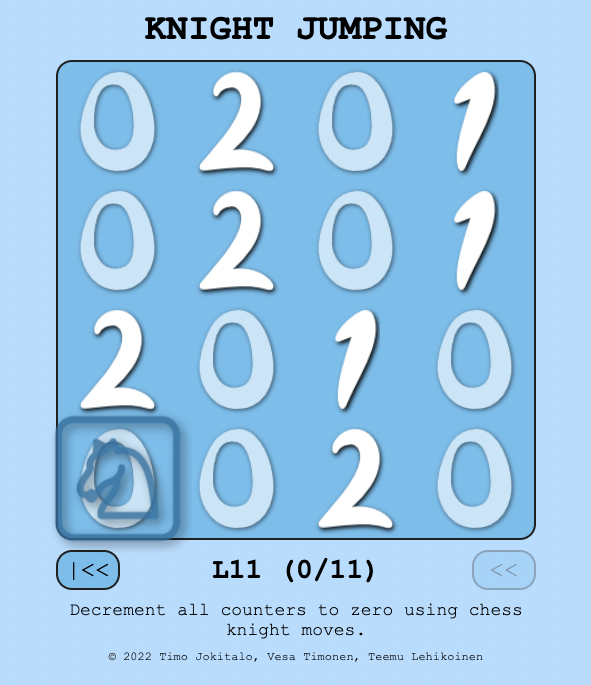

# COUNTER MAZE

Counter maze is a tiny multi-challenge puzzle made with HTML, CSS and native JavaScript.

Target of the puzzle is to decrement all the counters to zero by moving the cursor.

Play online https://vesatimonen.github.io/counter-maze/
